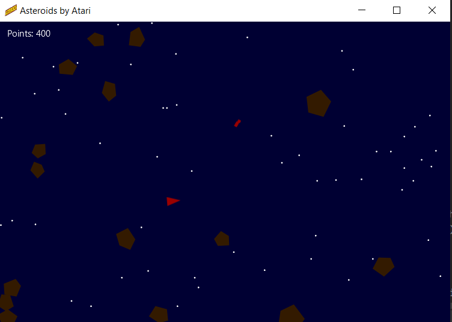

# Atari-Asteroids
The classic game Asteroids released on and by ATARI re-created using JavaFX.
  
To run this game, you need JavaFX and JDK installed. 
Creat an environment variable "PATH_TO_FX" pointing to the JavaFX's Lib. 
Once you meet these criterias simply click on run.bat in the home directory and you're good to go.
  

  
To fix issues:
<dl>
  <dt> Javafx Runtime Components missing. </dt>
  <dd> Check your JavaFX installation and check whether you have an environment variable "PATH_TO_FX" whos' value is the location of the JavaFX's lib directory.</dd>
  <dt> unable to access JAR file</dt>
  <dd> If you don't want to develop or do not have an java editor installed, then simply re-clone the repo.
    If you are a developer, then re-build the JAR artifact using your IDE's functionality, or from command line using "AsteroidsApplication" as the main class
  </dd>
  </dl>
